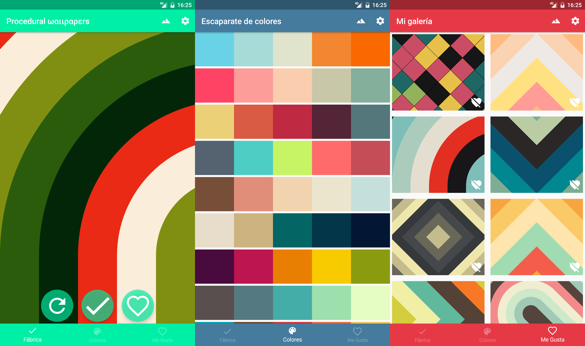
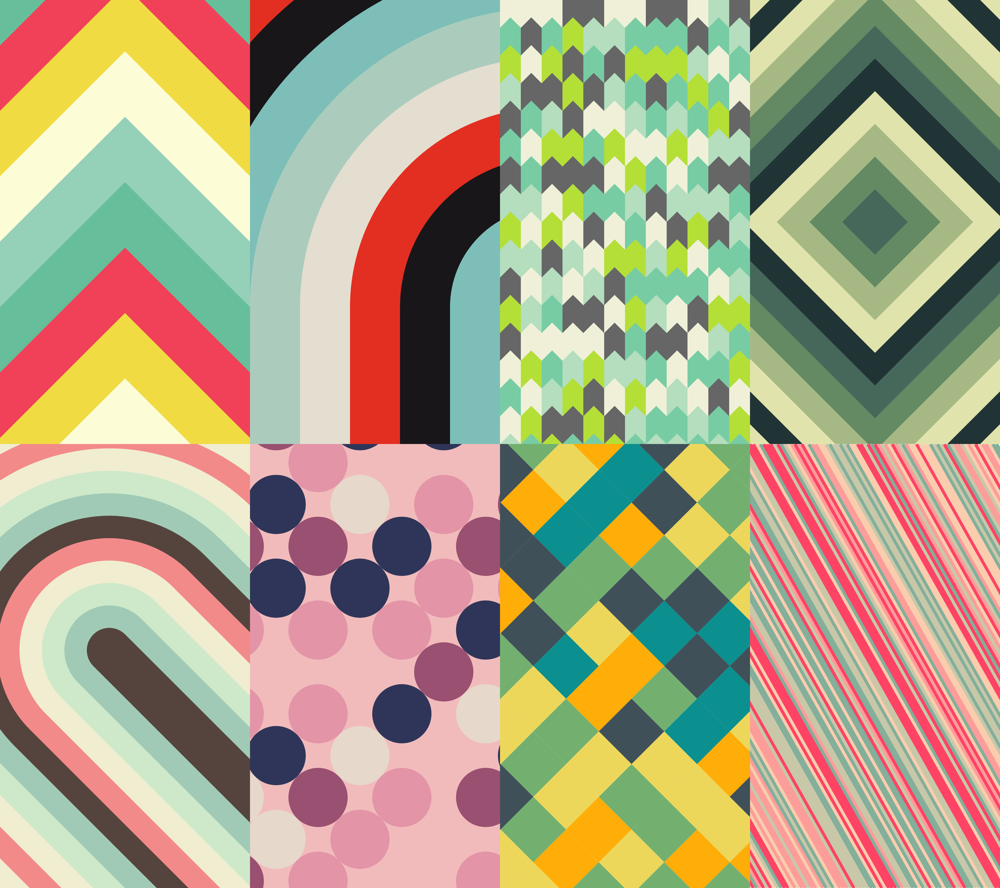

# Fábrica de Wallpapers

El objetivo del proyecto es desarrollar una aplicación de código abierto que permita al usuario final disponer de una herramienta de personalización única que brinde contenido aleatoriamente generado y visualmente placentero para su teléfono móvil. Intentando así disponer de un dispositivo con fondos de pantalla nuevos y únicos que se actualizan periódicamente sin necesidad de tener que preocuparse por hacerlo de forma manual

**Vídeo demostrativo:** https://youtu.be/MuOmOcUixPw

**APK Release 1.0:** https://github.com/hdmi/ProceduralWallpapers/blob/master/app/Fabrica%20de%20Wallpapers%20-%20signed.apk

**APK Debug 1.0 :** https://github.com/hdmi/ProceduralWallpapers/blob/master/app/Fabrica%20de%20Wallpapers%20-%20debug.apk

<h3>Capturas de pantalla</h3>

<h3>Estilos disponibles hasta la fecha</h3>

